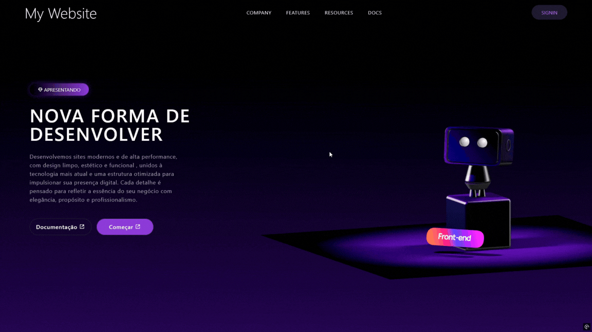

# 3D Website React



## 🚀 Tecnologias

Este projeto foi desenvolvido com as seguintes tecnologias:

- [React](https://react.dev/) - v19.1.1
- [Vite](https://vitejs.dev/) - v7.1.7
- [Tailwind CSS](https://tailwindcss.com/) - v3.4.18
- [@splinetool/react-spline](https://spline.design/) - v4.1.0 (Para elementos 3D)
- [Boxicons](https://boxicons.com/) - v2.1.4 (Para ícones)

## 💻 Projeto

Este é um website moderno desenvolvido com React, apresentando elementos 3D interativos usando Spline e uma interface responsiva com Tailwind CSS. O projeto combina design moderno com interatividade 3D para criar uma experiência única.

## 🔧 Instalação

```bash
# Clone este repositório
git clone https://github.com/GLessa0/3D-Website-React.git

# Acesse a pasta do projeto
cd 3D-Website-React

# Instale as dependências
npm install

# Execute a aplicação
npm run dev
```

## 🎨 Layout

O projeto utiliza um layout moderno com:
- Elementos 3D interativos
- Design responsivo
- Gradientes e efeitos visuais
- Interface limpa e moderna
